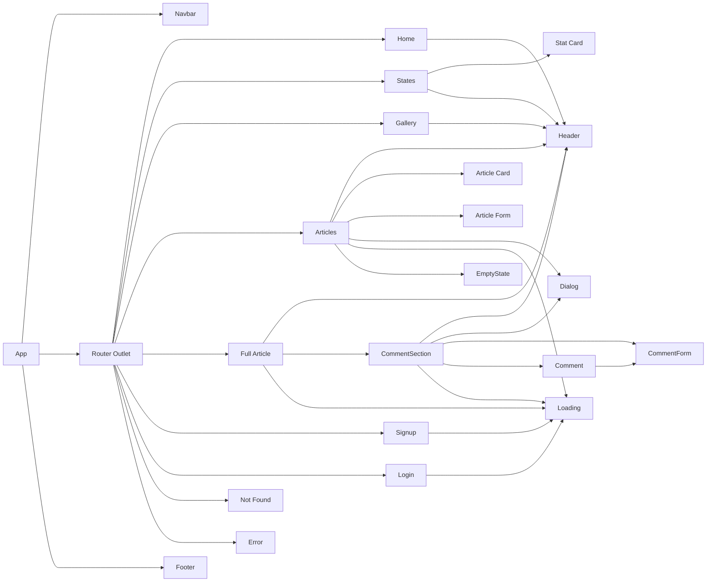

# Casa do Alemão

**Casa do Alemão** é uma SPA (single-page application) feita em Angular no bootcamp T-Academy. Os usuários podem, além de outras funcionalidades, acessar informações gerais sobre a Alemanha, publicar artigos e commentar nas publicações.

## Tecnologias utilizadas
- Angular 18
- Tailwind
- Angular Material

Frontend: foi utilizado Tailwind para estilização geral, e o SnackBar do Angular Material para implementar notificações de sucesso.

Backend: como o foco do projeto era o frontend, foi utilizada a biblioteca JSON Server para simular uma API no backend.


## Funcionalidades e permissões

| Função       | Ação                | Editores | Usuários | Visitantes |
|--------------|---------------------|----------|----------|------------|
| Informações Gerais | Visualizar    | ✔️       | ✔️       | ✔️         |
| Artigos      | Visualizar          | ✔️       | ✔️       | ✔️         |
| Artigos      | Publicar            | ✔️       | ❌       | ❌         |
| Artigos      | Editar              | ✔️       | ❌       | ❌         |
| Artigos      | Excluir             | ✔️       | ❌       | ❌         |
| Comentários  | Visualizar          | ✔️       | ✔️       | ✔️         |
| Comentários  | Comentar            | ✔️       | ✔️       | ❌         |
| Comentários  | Editar              | ✔️       | ✔️       | ❌         |
| Comentários  | Excluir             | ✔️       | ✔️       | ❌         |


## Componentes



## Configuração e execução

### Requisitos

- Node.js

### Executando a aplicação

1. **Clone o repositório:**
    ```bash
    git clone git@github.com:paulohenrique-gh/angular-casa-do-alemao.git
    cd angular-casa-do-alemao
    ```

2. **Instale as dependências:**
    ```bash
    npm install
    ```

3. **Inicie a aplicação**
    ```bash
    npm run start
    ```
    Serão executados os comandos `ng serve` e `npx json-server db.json` em paralelo devido à biblioteca **Concurrently**

5. **Acesse a aplicação:**

    Acesse a http://localhost:4200 no navegador de sua preferência


## Testando a aplicação

Você pode usar as credenciais abaixo para testar as funcionalidades:

- Editor:
    - Email: john.doe@example.com
    - Senha: password123

- Usuário:
    - Email: bob.brown@example.com
    - Senha: password101

Se preferir, pode também criar um novo cadastro no endereço http://localhost:4200/signup e acessar com o email e senha cadastrados

## Capturas

### Vídeo

https://github.com/user-attachments/assets/a1dc53bf-0354-4f02-a1f1-adb9ca729862


### Imagens

<details>
  <summary>Página Inicial</summary>
  
</details>

<details>
  <summary>Estados</summary>
  
</details>

<details>
  <summary>Galeria</summary>
  
</details>

<details>
  <summary>Artigos</summary>
  
</details>

<details>
  <summary>Formulário de Artigo</summary>
  
</details>

<details>
  <summary>Artigo Completo</summary>
  
</details>

<details>
  <summary>Pop-up de Confirmação</summary>
  
</details>

<details>
  <summary>Cadastro</summary>
  
</details>

<details>
  <summary>Login</summary>
  
</details>

<details>
  <summary>Erro</summary>
  
</details>

<details>
  <summary>Página Não Encontrada</summary>
  
</details>